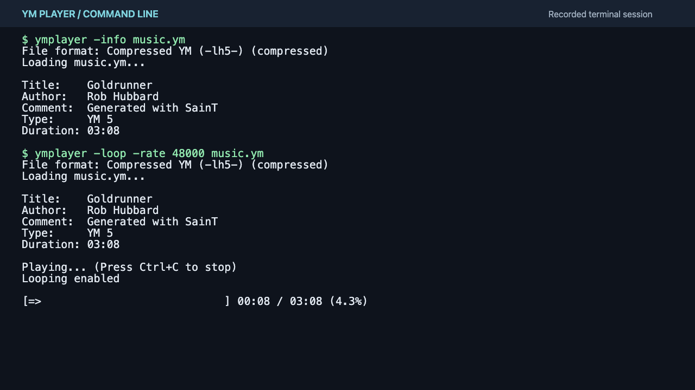
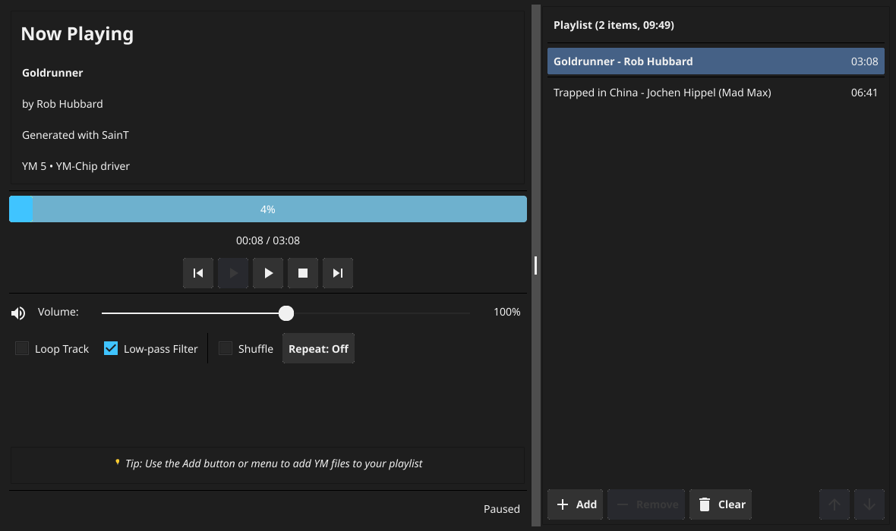
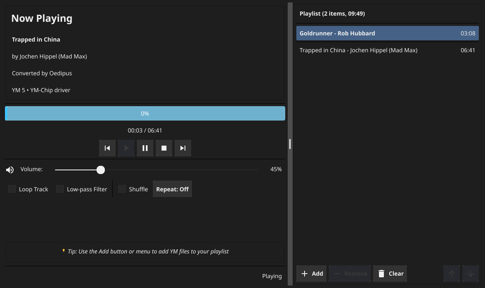
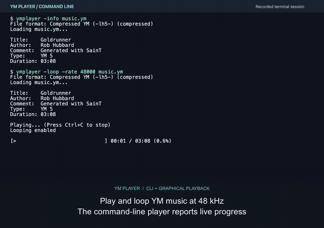

# YM Player 🎵

A cross-platform YM music file player written in Go, supporting the Atari ST YM2149 sound chip music format.


## Screenshots

Click a capture to open it at full size.

| Terminal player | Fyne playback |
| --- | --- |
| [](docs/media/cli.png) | [](docs/media/gui-playback.png) |

| Paused playback | Playlist management |
| --- | --- |
| [](docs/media/gui-paused.png) | [](docs/media/gui-playlist.png) |

## Presentation video

[](https://github.com/olivierh59500/ym-player/raw/refs/heads/main/docs/media/presentation.mp4)

**[Watch or download the 54-second presentation with sound — MP4](https://github.com/olivierh59500/ym-player/raw/refs/heads/main/docs/media/presentation.mp4)**

The GIF is silent. Open the MP4 to hear the music alongside the terminal and
Fyne interfaces. English captions are included directly in the video. An [English subtitle file](docs/media/presentation.en.srt) is
available for players that accept external subtitles. See
[presentation notes](docs/PRESENTATION.md) for the commands, workflow, and media
details.

## Overview

YM Player is a modern implementation of the STSound library in Go, capable of playing YM music files from the Atari ST era. It emulates the YM2149/AY-3-8910 sound chip and decodes register streams, sampled tracker formats, and compressed files. Available as both command-line tool and graphical application.

### Features

- 🎮 **YM2149/AY-3-8910 emulation** - Three tone channels, noise, envelopes, and ST-Sound effects
- 📦 **Multiple format support** - YM2!, YM3!, YM3b, YM5!, YM6!, MIX1, YMT1, YMT2
- 🗜️ **LZH compression support** - Handles compressed YM files (LH0, LH4, LH5)
- 🔊 **Real-time audio playback** - Using Oto v3 for cross-platform audio
- 🎛️ **Audio controls** - Volume adjustment, looping, low-pass filter
- 💾 **WAV export** - Save YM files as WAV for use in other applications
- 🖥️ **Cross-platform** - Works on Windows, macOS, Linux (Intel/ARM)
- 🎨 **Modern GUI** - User-friendly interface with playlist management

## Installation

### Prerequisites

- Go 1.24.4 or higher
- C compiler (for CGo dependencies)
- For GUI: System graphics libraries (usually pre-installed)

### Building from source

```bash
# Clone the repository
git clone https://github.com/olivierh59500/ym-player.git
cd ym-player

# Build command-line player
go build ./cmd/ymplayer

# Build GUI player
go build -tags gui -o ymplayer-gui ./cmd/ymplayer-gui

# Or install globally
go install ./cmd/ymplayer
go install -tags gui ./cmd/ymplayer-gui
```

## Usage

### GUI Application

The graphical interface provides an intuitive way to play YM files:

```bash
# Launch the GUI
./ymplayer-gui

# Or open with a specific file
./ymplayer-gui music.ym

```

A file passed on the command line loads into the Now Playing panel; press
**Play** to start it. Files added through **Add** or **File → Add Files** are
appended to the playlist. Selecting a playlist row loads and starts that track.
**Add Folder** scans the chosen folder for `.ym` and `.lzh` files.

The current GUI can print Fyne thread warnings. Include those messages and your
platform details when reporting a GUI problem.

#### GUI Features

- **Playlist Management**
  - Add individual files or entire folders
  - Save/Load playlists (M3U and JSON formats)
  - Sort by title, author, or duration
  - Shuffle playlist order

- **Playback Controls**
  - Play/Pause/Stop with visual feedback
  - Previous/Next track navigation
  - Progress bar with time display
  - Volume control with slider

- **Advanced Options**
  - Loop single track or entire playlist
  - Repeat modes: Off, One, All
  - Low-pass filter toggle
  - Shuffle playback

- **File Operations**
  - Export the current track to mono 16-bit PCM WAV
  - Automatic metadata display
  - Support for compressed YM files

### Command-Line Interface

#### Basic playback

```bash
# Play a YM file
./ymplayer music.ym

# Show file information only
./ymplayer -info music.ym
```

The default output is mono signed 16-bit PCM at 44,100 Hz, using a 2,048-sample
buffer. Flags must precede the input filename. `-info` prints metadata and exits
without opening an audio device. `-output null` renders with real-time pacing
but discards the sound. Press `Ctrl+C` to stop playback.

#### Command-line options

```
Usage: ymplayer [options] <ym-file>

Options:
  -rate int
        Sample rate (Hz) (default 44100)
  -buffer int
        Buffer size (default 2048)
  -loop
        Loop playback
  -volume float
        Volume (0.0 to 10.0) (default 1.0)
  -gain float
        Audio gain multiplier (default 1.0)
  -lowpass
        Enable lowpass filter (default true)
  -info
        Show file info only
  -output string
        Output backend: oto, wav, null (default "oto")
  -wav string
        Output WAV file (when using wav output)
```

#### Examples

```bash
# Play with double volume
./ymplayer -volume 2.0 music.ym

# Export to WAV file
./ymplayer -output wav -wav output.wav music.ym

# Play in loop with specific sample rate
./ymplayer -loop -rate 48000 music.ym

# Disable low-pass filter for sharper sound
./ymplayer -lowpass=false music.ym
```

## Supported Formats

### YM File Formats

The decoder supports every format implemented by the supplied ST-Sound v1.43:

| Signature | Playback |
| --- | --- |
| `YM2!` | MADMAX register streams and the 40 built-in digidrums |
| `YM3!` | Register streams |
| `YM3b` | Register streams with a little-endian loop frame |
| `YM5!` | Metadata, chip clock, frame rate, digidrums and SID |
| `YM6!` | YM5 features plus effect commands, including sync buzzer |
| `MIX1` | Sample blocks with source rates and repeats |
| `YMT1` | Sampled tracker streams, up to eight voices |
| `YMT2` | Tracker streams with sample repeat lengths and frequency shifts |

YM5/YM6 support interleaved and frame-ordered registers, signed and four-bit
digidrums, and extension bytes. YMT streams support both layouts as well.
Invalid historical loop points restart at frame zero. Digital samples are copied
before conversion, so `LoadMemory` does not modify the caller's data.

`YM4!` is explicitly unsupported in ST-Sound and here. `MIX2` is only an enum in
the reference, with no decoder. The reference's Sinus-SID routine is empty;
that command remains a no-op here too.

### Compression

- **Uncompressed** - Direct YM, MIX1 and YMT data
- **LH5** - Level-0 LHA, matching ST-Sound, including legacy filename-based headers
- **LH0** - Stored level-0 LHA (an additional Go feature)
- **LH4** - LZ77 with static Huffman coding (an additional Go feature)

Unsupported header levels, invalid Huffman trees and truncated bitstreams return
errors. Legacy CRC and header checksums are not enforced, matching ST-Sound.

### Playback compatibility

Audio is mono signed 16-bit PCM. Rendering is independent of callback buffer size
at a given output rate. Register and tracker frame timing retains ST-Sound's
integer `outputRate / frameRate` sample interval. Frame rates must fit within
the selected output rate; MIX source rates must have a nonzero Q12 increment.

Restart and Stop reset chip, sample and filter state. Seeking register/tracker
music reconstructs earlier playback state, including held notes and effects;
seeking far into a long song therefore takes more work than jumping a pointer.
The final frame is rendered in full, and any unused tail of the final buffer is
silence. A final partially filled buffer is returned by `Compute`; the next call
returns false. MIX blocks outside their sample buffer are rejected.

### Validation

The compatibility audit compared Go with the supplied C++ engine, independently
compiled as a local test oracle. No C++ code is needed to build this module.

- All **968 archives in the audit corpus** decompress byte-for-byte like ST-Sound and load.
- A larger local corpus contains **4,933 paths / 3,917 distinct files**. All but
  one truncated MIX1 file load and render; AddressSanitizer confirms an
  out-of-bounds read in the reference for that file.
- **29 distinct tracks**, covering all eight formats, match reference PCM during
  their playback in 60-second comparisons. Two short tracks differ only after
  EOF, where Go clears the reference's residual DC-filter tail.
- Checked-in tests cover all 16 envelope shapes, SID/sync timing, YM2 samples,
  four-bit drums, large digital samples, loader boundaries, buffer sizes,
  looping, restart, seeking and final-frame handling.

The C++ audio oracle normalizes its signed `1 << 31` timer unit to unsigned and
widens its envelope-period multiplication to remove two arithmetic defects.
Reference PCM hashes in the Go tests record these settings. This validates the
supplied engine's behavior on these cases; it is not a hardware measurement.

Run the regression suite with `go test -race ./...`.

### Playlist Formats
- **M3U** - Standard playlist format
- **JSON** - Extended format with metadata

JSON preserves playlist metadata and all stored paths. The M3U reader accepts
`.ym` entries and uses each listed path directly; it does not resolve paths
relative to the playlist file. Use paths that are valid from the application's
working directory.

The GUI's per-item **Remove**, **Move Up**, and **Move Down** controls are disabled
placeholders. Sorting, shuffling, and clearing the playlist are implemented.
After using Previous/Next, the selected-row highlight may remain on the earlier
entry; the Now Playing panel identifies the loaded track.

## Project Structure

```
ym-player/
├── cmd/
│   ├── ymplayer/       # Command-line player
│   │   └── main.go
│   └── ymplayer-gui/   # GUI player
│       ├── main_gui.go # Entry point enabled by -tags gui
│       ├── gui.go      # Interface, playback, and export actions
│       └── playlist.go # JSON/M3U, sorting, and shuffle
├── pkg/
│   ├── audio/          # Audio output interfaces
│   │   ├── output.go
│   │   └── oto.go
│   ├── lzh/            # LZH decompression
│   │   └── decoder.go
│   └── stsound/        # YM emulation core
│       ├── stsound.go  # Main API
│       ├── ym2149ex.go # YM2149 chip emulation
│       ├── ymmusic.go  # Music player logic
│       ├── ymload.go   # File loading
│       └── types.go    # Type definitions
├── go.mod
├── go.sum
└── README.md
```

## API Usage

### Basic Example

```go
package main

import (
    "log"
    "github.com/olivierh59500/ym-player/pkg/stsound"
)

func main() {
    // Create player with 44.1kHz sample rate
    player := stsound.CreateWithRate(44100)
    defer player.Destroy()

    // Load YM file
    if err := player.Load("music.ym"); err != nil {
        log.Fatal(err)
    }

    // Get music info
    info := player.GetInfo()
    log.Printf("Title: %s", info.SongName)
    log.Printf("Author: %s", info.SongAuthor)

    // Start playback
    player.Play()

    // Generate audio samples
    buffer := make([]int16, 2048)
    for player.Compute(buffer, len(buffer)) {
        // Process audio buffer
        // Send to audio output...
    }
}
```

### Integration with Game Engines

The [ST-Sound API](pkg/stsound/stsound.go) loads files with `Load` or `LoadMemory`
and renders mono `int16` samples through `Compute`. Feed those samples into the
engine's audio stream at the rate used by `CreateWithRate`. Looping, low-pass
filtering, playback position, and seeking are exposed by the same API. See
[sampled-format notes](docs/DIGITAL_FORMATS.md) for MIX1 and YMT playback.

## Technical Details

### YM2149 Emulation

The emulator accurately reproduces the behavior of the YM2149/AY-3-8910 sound chip:
- 3 square wave tone generators
- 1 noise generator
- 1 envelope generator
- Mixer controls for tone/noise
- Special effects (SID, DigiDrum, Sync-Buzzer)

### Architecture Support

The player correctly handles endianness differences:
- YM5/YM6 numeric fields use big-endian order.
- The YM3b loop frame and LHA header sizes use little-endian order.
- Each loader handles the byte order required by its format on Intel and ARM.

## Building for Different Platforms

### Command-line version

```bash
# Windows
GOOS=windows GOARCH=amd64 go build -o ymplayer.exe ./cmd/ymplayer

# macOS (Intel)
GOOS=darwin GOARCH=amd64 go build -o ymplayer-mac ./cmd/ymplayer

# macOS (Apple Silicon)
GOOS=darwin GOARCH=arm64 go build -o ymplayer-mac-arm64 ./cmd/ymplayer

# Linux
GOOS=linux GOARCH=amd64 go build -o ymplayer-linux ./cmd/ymplayer

# Linux (ARM)
GOOS=linux GOARCH=arm64 go build -o ymplayer-linux-arm64 ./cmd/ymplayer
```

### GUI version

These commands also require a C compiler and graphics dependencies for the
target platform. Changing `GOOS` alone does not provide the GUI cross-compilation
toolchain.

```bash
# Windows
GOOS=windows GOARCH=amd64 go build -tags gui -o ymplayer-gui.exe ./cmd/ymplayer-gui

# macOS (Intel)
GOOS=darwin GOARCH=amd64 go build -tags gui -o ymplayer-gui-mac ./cmd/ymplayer-gui

# macOS (Apple Silicon)
GOOS=darwin GOARCH=arm64 go build -tags gui -o ymplayer-gui-mac-arm64 ./cmd/ymplayer-gui

# Linux
GOOS=linux GOARCH=amd64 go build -tags gui -o ymplayer-gui-linux ./cmd/ymplayer-gui
```

## Contributing

Contributions are welcome! Please feel free to submit a Pull Request.

### Development

```bash
# Run tests
go test ./...

# Run with race detector
go run -race ./cmd/ymplayer music.ym

# Inspect a track without opening an audio device
go run ./cmd/ymplayer -info music.ym
```

## Credits

- Original STSound library by Arnaud Carré (Leonard/Oxygene)
- YM file format by Leonard/Oxygene
- LZH decompression based on Haruhiko Okumura and Kerwin F. Medina's work
- Fyne GUI framework by Andrew Williams and contributors
- Go port and enhancements by Olivier Houte

## License

This project declares the BSD 2-Clause license. A separate `LICENSE` file is
currently missing from this repository.

## Resources

- [YM Format Documentation](http://leonard.oxg.free.fr/ymformat.html)
- [Atari ST Sound Archive](http://sndh.atari.org/)
- [STSound Original Library](http://leonard.oxg.free.fr/stsound.html)
- [Fyne Framework](https://fyne.io/)

## Troubleshooting

### GUI Issues

#### Application won't start
- Ensure graphics drivers are up to date
- Check if OpenGL is available on your system
- Try running the command-line version first

#### Console shows thread warnings
- Include the messages, platform, and reproduction steps in a bug report.
- The current GUI may emit these warnings while updating widgets.
- Use `-info` or WAV export from the CLI when you need a workflow without GUI rendering.

#### Dark theme issues
- The GUI adapts to your system theme
- Force light mode by setting environment: `FYNE_THEME=light`

### Audio Issues

#### No sound output
- Check your system's audio settings
- Try increasing the buffer size: `-buffer 4096`
- Verify the YM file is not corrupted

#### Choppy playback
- Increase buffer size: `-buffer 4096`
- Lower sample rate: `-rate 22050`
- Close other audio applications

#### "Context already created" error
- Restart the application
- Check if another instance is running
- Update to the latest version

### File Issues

#### Cannot load file
- Ensure the file is a valid YM format
- Check if the file is compressed (look for LZH header)
- Try with a known working YM file

#### Playlist won't save
- Check write permissions in the directory
- Ensure valid filename extension (.m3u or .json)

## Changelog

### v1.1.0 (2025-06-05)
- Added GUI application with Fyne
- Playlist management support
- M3U and JSON playlist formats
- Modern dark/light theme
- Improved audio output handling
- Fixed Oto context management
- Added precise volume control (1% increments)
- Known issue: Fyne thread warnings may appear in the GUI console

### v1.0.0 (2025-06-05)
- Initial release
- Full YM2149 emulation
- Support for YM2, YM3, YM3b, YM5 and YM6 formats
- LZH decompression support
- Cross-platform audio output
- WAV export functionality
